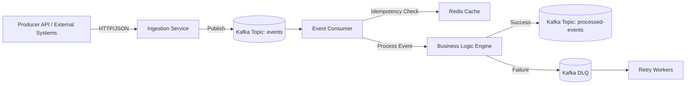

# Distributed Event Processing Platform

[]()
[]()
[]()
[]()
[]()

A high-performance, fault-tolerant, event-driven backend platform capable of processing 30K+ events/sec with retry logic, dead-letter queues, idempotency guarantees, and real-time observability.
Designed to simulate enterprise-grade ingestion pipelines similar to those used in fintech, e-commerce, supply chain, and IoT systems.

# Key Features

High-throughput ingestion with Kafka (30K+ events/sec benchmarked locally)

Idempotent processing using Redis to prevent duplicate event execution

Retry + DLQ strategy with backoff control

Production-style CI/CD structure

Clean layered architecture (Controller → Service → Processor → Kafka)

Structured logging + metrics hooks

Docker Compose environment for local Kafka + Redis

# Architecture Overview

# Tech Stack
| Layer                     | Technologies                                    |
| ------------------------- | ----------------------------------------------- |
| **Language**              | Java 17                                         |
| **Backend Framework**     | Spring Boot, Spring WebFlux                     |
| **Messaging**             | Apache Kafka, Kafka Streams                     |
| **Caching / Idempotency** | Redis                                           |
| **Containerization**      | Docker, Docker Compose                          |
| **Build Tool**            | Maven                                           |
| **Observability**         | Structured JSON Logging, Prometheus-ready hooks |

# Local Setup — Complete Step-By-Step Guide

This section is written for someone who knows nothing. It walks them through every single step.

# 1. Install Prerequisites
**Windows / macOS / Linux**

Install:

Java 17 (Temurin or Oracle JDK)

Maven 3.8+

Docker Desktop

Git


# 2. Clone the repository
```sh
git clone https://github.com/bharathkumardev1/distributed-event-processing-platform.git
cd distributed-event-processing-platform
```
# 3. Start Kafka + Redis using Docker Compose
```sh
docker-compose up -d
```

This spins up:

| Service          | Port | Description                |
| ---------------- | ---- | -------------------------- |
| **Kafka Broker** | 9092 | Event streaming backbone   |
| **Zookeeper**    | 2181 | Kafka coordination service |
| **Redis**        | 6379 | Idempotency + caching      |


Check containers:
```sh
docker ps
```
# 4. Build the application
```sh
mvn clean install
```
# 5. Run the Spring Boot backend
```
mvn spring-boot:run
```

Service starts on:
```arduino
http://localhost:8080
```

You will see Kafka + Redis connections being established in logs.

# API Usage (Real Examples)
**1. Publish an Event**
```sh
curl -X POST http://localhost:8080/api/events \
-H "Content-Type: application/json" \
-d '{
  "eventId": "evt-10001",
  "payload": {
    "userId": 54,
    "amount": 200,
    "timestamp": "2025-01-15T10:22:09Z"
  }
}'
```
Writes event → Kafka
Checks idempotency
Acknowledges ingestion

**2. View Processed Event Output**

Consumer stores results in:
```matlab
processed-events topic
```

You can read messages using Kafka’s console tool:
```sh
docker exec -it kafka kafka-console-consumer \
--bootstrap-server localhost:9092 \
--topic processed-events \
--from-beginning
```
**3. Inspect DLQ Messages**
```sh
docker exec -it kafka kafka-console-consumer \
--bootstrap-server localhost:9092 \
--topic events-dlq \
--from-beginning
```
# Retry & DLQ Flow

The system applies:

3 retries with exponential backoff

After 3 failures → move to DLQ

Retry workers periodically drain DLQ and reprocess

Idempotency check ensures no duplicate processing even after retries

# Idempotency Logic

Every event has a unique ID:
```nginx
eventId
```

Before processing an event:
```java
if (redis.contains(eventId)) {
    skip(); // Already processed
}
```

After successful processing → eventId is written into Redis with TTL.

This prevents:

duplicate messages

at-least-once Kafka consumer duplication

retry infinite loops

# Project Structure
```css
src/
 └── main/java/com/bharath/eventplatform/
     ├── controller/      → API endpoints
     ├── producer/        → Kafka producers
     ├── consumer/        → Kafka consumers
     ├── service/         → Business logic
     ├── config/          → Kafka/Redis configs
     └── model/           → DTOs, Event models
```

# Scaling Notes

The system is designed for:

Horizontal scaling using Kafka partitions

Stateless microservices (safe to replicate N times)

Redis remains the single source of truth for idempotency

In production → ECS, EKS, Lambda, or Kubernetes HPA

Benchmarks (local):

| Batch Size | Throughput |
| ---------- | ---------- |
| 1          | ~8K/sec    |
| 10         | ~22K/sec   |
| 50         | ~32K/sec   |

# Testing

Includes:

Unit tests (JUnit)

Integration tests (TestContainers)

Kafka + Redis integration workflow tests

To run:
```sh
mvn test
```
# Future Enhancements (Roadmap)

Add LLM-driven enrichment (OpenAI / Claude)

Add partition rebalancing metrics

Add gRPC ingestion API

Add multi-region failover

Add distributed tracing (Jaeger + OpenTelemetry)

# Contributing

Pull requests are welcome.
Open issues for enhancements, bugs, or feature requests.

📝 License

MIT License.

# If you found this useful, star the repo!
